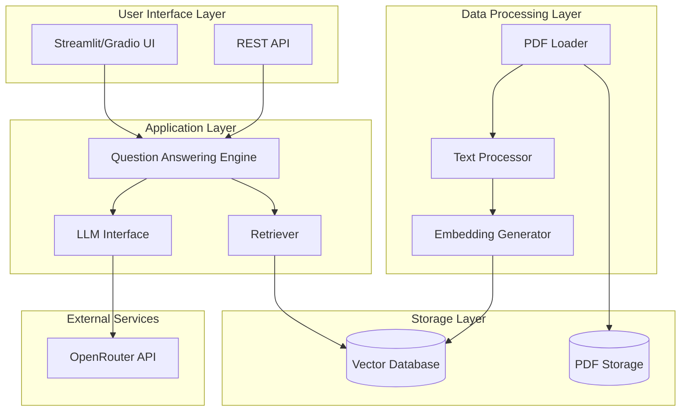

# System Architecture

## Overview

The PDF Question Answering System is built using a Retrieval-Augmented Generation (RAG) architecture that combines document retrieval with large language models to answer questions based on PDF content.

## Architecture Diagram

## Component Descriptions

### 1. User Interface Layer
- **Streamlit UI**: Interactive web interface for uploading PDFs and asking questions
- **FastAPI REST API**: RESTful endpoints for programmatic access

### 2. Application Layer
- **Question Answering Engine**: Orchestrates the RAG pipeline
- **Retriever**: Searches vector database for relevant document chunks
- **LLM Interface**: Manages communication with language models

### 3. Data Processing Layer
- **PDF Loader**: Extracts text from PDF documents using PyMuPDF
- **Text Processor**: Chunks and cleans text using LangChain for optimal retrieval
- **Embedding Generator**: Creates vector embeddings using Sentence Transformers

### 4. Storage Layer
- **Vector Database**: Stores document embeddings using ChromaDB
- **PDF Storage**: Persists original PDF files

### 5. External Services
- **OpenRouter API**: Provides access to multiple LLM models for answer generation

## Data Flow

### Document Ingestion
1. User uploads PDF through UI/API
2. PDF Loader extracts text content
3. Text Processor chunks text into manageable segments
4. Embedding Generator creates vector representations
5. Vectors stored in Vector Database

### Question Answering
1. User submits question through UI/API
2. Question is embedded using same embedding model
3. Retriever searches Vector Database for similar chunks
4. Retrieved chunks + question sent to LLM
5. LLM generates answer based on context
6. Answer returned to user with source references

## Technology Stack

- **Language**: Python 3.8+
- **Backend**: FastAPI
- **Frontend**: Streamlit
- **PDF Processing**: PyMuPDF
- **Text Chunking**: LangChain
- **Embeddings**: Sentence Transformers (all-MiniLM-L6-v2)
- **Vector Database**: ChromaDB
- **LLM**: OpenRouter API (supports multiple models)
- **API Framework**: FastAPI with Uvicorn

## Scalability Considerations

- Modular design allows easy swapping of components
- ChromaDB can be scaled or migrated to cloud solutions if needed
- FastAPI enables horizontal scaling with async support
- OpenRouter provides access to multiple LLM providers
- Async processing for large document batches
