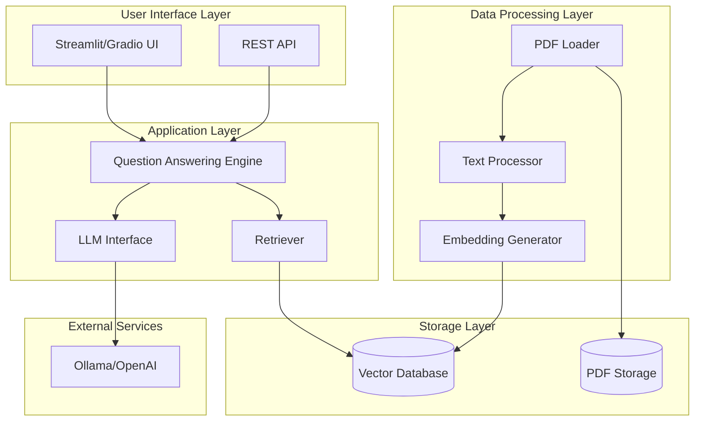

# System Architecture

## Overview

The PDF Question Answering System is built using a Retrieval-Augmented Generation (RAG) architecture that combines document retrieval with large language models to answer questions based on PDF content.

## Architecture Diagram

## Component Descriptions

### 1. User Interface Layer
- **Streamlit UI**: Interactive web interface for uploading PDFs and asking questions
- **REST API**: RESTful endpoints for programmatic access

### 2. Application Layer
- **Question Answering Engine**: Orchestrates the RAG pipeline
- **Retriever**: Searches vector database for relevant document chunks
- **LLM Interface**: Manages communication with language models

### 3. Data Processing Layer
- **PDF Loader**: Extracts text from PDF documents
- **Text Processor**: Chunks and cleans text for optimal retrieval
- **Embedding Generator**: Creates vector embeddings from text

### 4. Storage Layer
- **Vector Database**: Stores document embeddings (ChromaDB/FAISS)
- **PDF Storage**: Persists original PDF files

### 5. External Services
- **Ollama/OpenAI**: Provides LLM capabilities for answer generation

## Data Flow

### Document Ingestion
1. User uploads PDF through UI/API
2. PDF Loader extracts text content
3. Text Processor chunks text into manageable segments
4. Embedding Generator creates vector representations
5. Vectors stored in Vector Database

### Question Answering
1. User submits question through UI/API
2. Question is embedded using same embedding model
3. Retriever searches Vector Database for similar chunks
4. Retrieved chunks + question sent to LLM
5. LLM generates answer based on context
6. Answer returned to user with source references

## Technology Stack

- **Framework**: Python 3.8+
- **LLM**: Ollama (Llama2, Mistral) or OpenAI
- **Embeddings**: Sentence Transformers
- **Vector DB**: ChromaDB or FAISS
- **UI**: Streamlit or Gradio
- **API**: FastAPI
- **PDF Processing**: PyPDF2, pdfplumber

## Scalability Considerations

- Modular design allows easy swapping of components
- Vector database can be scaled to cloud solutions (Pinecone, Weaviate)
- API layer enables horizontal scaling
- Async processing for large document batches
